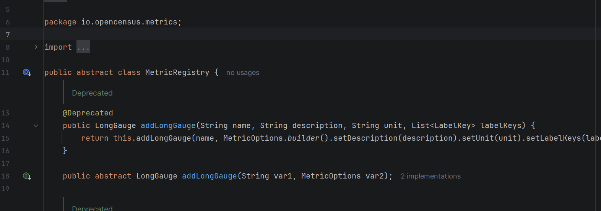
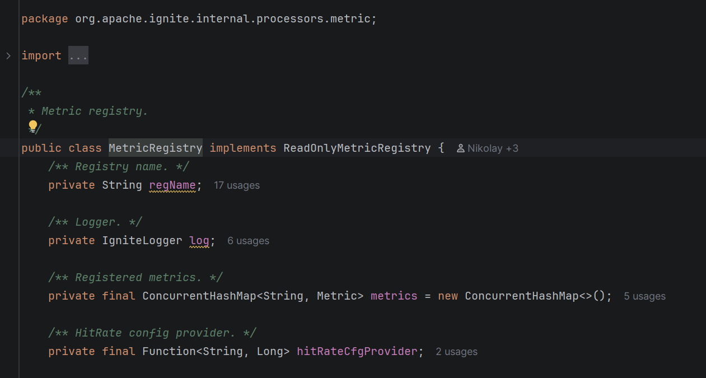

## Описание задачи

В данной работе рассмотривается вариант межкластерного взаимодействия Active-Passive с помощью брокера сообщений Kafka.

### Настройка окружения

1. Перейти в директорию kafka

> C:\Users\Ishkhan\IdeaProjects\ignite-cdc-a\kafka

2. Поднять брокер сообщения Kafka

> docker-compose up -d

3. Перейти в корень проекта Active кластера

> cd C:\Users\Ishkhan\IdeaProjects\ignite-cdc-a

4. Установить ignite-cdc-ext.***.jar в папку libs Active кластера. В папке shelve хранятся различные версии расширения. Для версий ignite 2.15 и ниже - ignite-cdc-ext-1.2.1-8.jar (скомпилирован и адаптированный на 8 java). Для версии выше ignite 2.15 - ignite-cdc-ext-1.0.0.jar (скомпилирован на 11 java).


5. Поднять Active кластер Ignite a
 
> docker-compose up -d

6. Необходимо активировать Active кластер после запуска всех нод.

> docker-compose exec -it ignite-node-a-1 ./apache-ignite/bin/control.sh --set-state ACTIVE

7. Создать таблицу CDC_TEST1 в кластере Active. Можно подключиться к кластеру через DBeaver. Важный ньюанс, VALUE_TYPE очень важно явно указать, иначе Ignite сгенерирует случайное значение и при передаче данных реплицирующая и реплицируемые таблицы не смапятся.    

```
CREATE TABLE CDC_TEST1 (
id INT,
name VARCHAR(100),
value DECIMAL(10, 2),
status VARCHAR(20),
created_date TIMESTAMP,
updated_date TIMESTAMP,
PRIMARY KEY (id)
) WITH "CACHE_NAME=CDC_TEST1, TEMPLATE=PARTITIONED, VALUE_TYPE=SQL_CDC_TEST1_TYPE";
```
8. Запустить ./ignite-cdc.sh на каждой ноде Active кластера.

> docker-compose exec -it ignite-node-a-1 ./apache-ignite/bin/ignite-cdc.sh config/cdc-config.xml

> docker-compose exec -it ignite-node-a-2 ./apache-ignite/bin/ignite-cdc.sh config/cdc-config.xml

> docker-compose exec -it ignite-node-a-3 ./apache-ignite/bin/ignite-cdc.sh config/cdc-config.xml

9. Перейти в корень проекта Passive кластера

> cd C:\Users\Ishkhan\IdeaProjects\ignite-cdc-b

10. Установить ignite-cdc-ext.***.jar в папку libs Passive кластера. В папке shelve хранятся различные версии расширения. Для версий ignite 2.15 и ниже - ignite-cdc-ext-1.2.1-8.jar (скомпилирован и адаптированный на 8 java). Для версии выше ignite 2.15 - ignite-cdc-ext-1.0.0.jar (скомпилирован на 11 java).


11. Поднять Passive кластер Ignite b

> docker-compose up -d

12. Необходимо активировать Passive кластер после запуска всех нод.
> docker-compose exec -it ignite-node-b-1 ./apache-ignite/bin/control.sh --set-state ACTIVE

13. Создать таблицу CDC_TEST1 в кластере Passive. Важный ньюанс, VALUE_TYPE очень важно явно указать, иначе Ignite сгенерирует случайное значение и при передаче данных реплицирующая и реплицируемые таблицы не смапятся.

```
CREATE TABLE CDC_TEST1 (
id INT,
name VARCHAR(100),
value DECIMAL(10, 2),
status VARCHAR(20),
created_date TIMESTAMP,
updated_date TIMESTAMP,
PRIMARY KEY (id)
) WITH "CACHE_NAME=CDC_TEST1, TEMPLATE=PARTITIONED, VALUE_TYPE=SQL_CDC_TEST1_TYPE";
```

14. Запустить один раз ./kafka-to-ignite.sh на любой ноде Passive кластера

>  docker-compose exec -it ignite-node-b-1 ./apache-ignite/bin/kafka-to-ignite.sh -v /opt/ignite/apache-ignite/config/kafka-config.xml

15. Вставить тестовую запись в Active кластер. Можно подключиться к кластеру через DBeaver.

> INSERT INTO CDC_TEST1 (id, name, value, status, created_date, updated_date)
VALUES (1, 'Товар А', 1500.50, 'ACTIVE', CURRENT_TIMESTAMP, CURRENT_TIMESTAMP);

### Пример различий ignite 2.15 и ignite 2.18
> 
> 
> 
> 
> 